<h1 align=center>
	<b>Net_Practice</b>
</h1>

<h2 align=center>Complete Index</h2>

# Complete Index

## SECTION 1: NETWORK FUNDAMENTALS
- 1.1 What is a Network?
  - Public Networks
  - Private Networks

- 1.2 TCP/IP Fundamentals
  - The TCP/IP Model Layers
  - TCP (Transmission Control Protocol)
  - IP (Internet Protocol)

- 1.3 IPv4 Addressing
  - IPv4 Address Structure
  - Network vs Host Portions
  - Binary Representation
  - Reserved Addresses

- 1.4 Subnet Masks
  - Dotted Decimal Notation
  - CIDR Notation
  - Valid Mask Octets
  - Network/Broadcast Addresses

## SECTION 2: SUBNET CALCULATIONS
- 2.1 Complete Subnet Reference Table
  - /32 to /24 (Small Networks)
  - /23 to /16 (Medium Networks)
  - /15 to /8 (Large Networks)

- 2.2 IP Range Calculators
  - Starting IP Calculation
  - Ending IP Calculation
  - Usable IP Count

- 2.3 Special Address Ranges
  - Private IP Ranges (RFC 1918)
  - Loopback Addresses
  - Multicast Addresses
  - Experimental/Reserved

## SECTION 3: NETWORK DEVICES
- 3.1 Network Switches
  - Switch Functionality
  - Layer 2 Operation
  - Broadcast Domains

- 3.2 Routers
  - Router Functionality
  - Layer 3 Operation
  - Interface Requirements
  - Non-overlapping Rule

- 3.3 Routing Tables
  - Table Structure
  - Destination Field
  - Next Hop Field
  - Default Routes
  - Direct vs Remote Networks

## SECTION 4: INTERNET CONNECTIVITY
- 4.1 ISP and Public IPs
  - Public IP Assignment
  - Static vs Dynamic IPs

- 4.2 NAT (Network Address Translation)
  - Static NAT
  - Dynamic NAT
  - PAT (Port Address Translation)

- 4.3 DHCP (Dynamic Host Configuration Protocol)
  - DHCP Discovery Process
  - DHCP Offer
  - DHCP Request
  - DHCP Acknowledgment

- 4.4 Public vs Private IPs
  - Public IP Characteristics
  - Private IP Characteristics

## SECTION 5: LEVEL SOLUTIONS (Grouped by Concept)
- **GROUP A: Basic Concepts**
  - Level 1 - Direct Connections
  - Level 2 - Subnet Boundaries
  - Level 3 - Switch Networks

- **GROUP B: Router Introduction**
  - Level 4 - First Router
  - Level 5 - Routing Tables Introduction

- **GROUP C: Internet & Multiple Networks**
  - Level 6 - Internet Connectivity
  - Level 7 - Multiple Routers
  - Level 8 - Internet with Multiple Hosts

- **GROUP D: Complex Scenarios**
  - Level 9 - Complex Multi-Network
  - Level 10 - Final Challenge

## SECTION 6: LEARNING TOOLS
- 6.1 Quick Reference Charts
  - Common Pitfalls Table
  - Verification Checklist

- 6.2 Practice Exercises
  - Subnet Calculation Practice
  - Routing Table Exercises
  - Network Design Problems

## APPENDIX: Quick Reference Cards
- Subnet Mask Quick Card
- Binary to Decimal Quick Card
- Common Network Addresses

---

# SECTION 1: NETWORK FUNDAMENTALS

<h2 id="Network">
1.1 What is a Network?
</h2>

A **Network** in computing is a group of two or more devices (nodes) that can communicate by **sending** and **receiving** data packets.

### 1.1.1 Public Networks
| Type | Description | Example | Access Control |
|------|-------------|---------|----------------|
| **Public Network** | Open to anyone, minimal access control | The Internet | None/Minimal |

### 1.1.2 Private Networks
| Type | Description | Example | Access Control |
|------|-------------|---------|----------------|
| **Private Network** | Restricted access, controlled environment | Home/Office network | Authentication required |

<h2 id="TCP">
1.2 TCP/IP Fundamentals
</h2>

### 1.2.1 The TCP/IP Model Layers

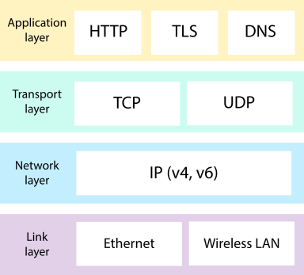

| Layer | Protocols | Function | Data Unit |
|-------|-----------|----------|-----------|
| Application | HTTP, FTP, DNS, SMTP | User applications | Data/Message |
| Transport | **TCP**, UDP | Data segmentation & reliability | Segment |
| Internet | **IP**, ICMP, ARP | Addressing & routing | Packet |
| Network Access | Ethernet, WiFi, PPP | Physical transmission | Frame |

### 1.2.2 TCP (Transmission Control Protocol)
- Breaks data into packets
- Ensures reliable delivery
- Handles packet ordering
- Manages flow control
- Reassembles at destination

### 1.2.3 IP (Internet Protocol)
- Provides addressing system
- Handles routing between networks
- Connectionless protocol
- Best-effort delivery

<h2 id="IPv4">
1.3 IPv4 Addressing
</h2>

### 1.3.1 IPv4 Address Structure

An IPv4 address is a 32-bit number divided into four 8-bit octets:
- Format: `W.X.Y.Z` where each octet ranges from 0-255
- Total possible addresses: 4,294,967,296

### 1.3.2 Network vs Host Portions

Every IP address contains two parts:
- **Network Address**: Identifies the network (must be same for devices to communicate)
- **Host Address**: Identifies specific device (must be unique within network)

### 1.3.3 Binary Representation Examples

| Decimal IP | Binary Representation |
|------------|----------------------|
| 192.168.1.1 | 11000000.10101000.00000001.00000001 |
| 10.0.0.1 | 00001010.00000000.00000000.00000001 |
| 172.16.0.1 | 10101100.00010000.00000000.00000001 |
| 255.255.255.0 | 11111111.11111111.11111111.00000000 |

### 1.3.4 Reserved Addresses

| Address Range | Purpose | RFC |
|---------------|---------|-----|
| 0.0.0.0/8 | "This network" | RFC 1122 |
| 10.0.0.0/8 | Private Class A | RFC 1918 |
| 127.0.0.0/8 | Loopback | RFC 1122 |
| 169.254.0.0/16 | Link-local (APIPA) | RFC 3927 |
| 172.16.0.0/12 | Private Class B | RFC 1918 |
| 192.168.0.0/16 | Private Class C | RFC 1918 |
| 224.0.0.0/4 | Multicast | RFC 5771 |
| 240.0.0.0/4 | Reserved/Experimental | RFC 1112 |
| 255.255.255.255 | Limited Broadcast | RFC 919 |

<h2 id="SubnetMasks">
1.4 Subnet Masks
</h2>

### 1.4.1 Dotted Decimal Notation
Traditional format: `255.255.255.0`

### 1.4.2 CIDR Notation
Compact format: `/24` (number of network bits)

### 1.4.3 Valid Mask Octets

| Binary | Decimal | CIDR Range |
|--------|---------|------------|
| 00000000 | 0 | /0 to /7 |
| 10000000 | 128 | /8 to /15 |
| 11000000 | 192 | /16 to /23 |
| 11100000 | 224 | /24 |
| 11110000 | 240 | /25 to /28 |
| 11111000 | 248 | /29 |
| 11111100 | 252 | /30 |
| 11111110 | 254 | /31 |
| 11111111 | 255 | /32 |

### 1.4.4 Network and Broadcast Addresses

In every subnet, two addresses are reserved:
- **Network Address**: First address (all host bits 0)
- **Broadcast Address**: Last address (all host bits 1)

---

# SECTION 2: SUBNET CALCULATIONS

<h2 id="SubnetTable">
2.1 Complete Subnet Reference Table with IP Ranges
</h2>

### 2.1.1 Small Networks (/32 to /24)

| CIDR | Subnet Mask | Total IPs | Usable IPs | Network Pattern | Broadcast Pattern | Use Case |
|------|-------------|-----------|------------|-----------------|-------------------|----------|
| /32 | 255.255.255.255 | 1 | 1 | x.x.x.x | x.x.x.x | Single host |
| /31 | 255.255.255.254 | 2 | 2 | x.x.x.0 | x.x.x.1 | Point-to-point (RFC 3021) |
| /30 | 255.255.255.252 | 4 | 2 | x.x.x.0 | x.x.x.3 | Point-to-point links |
| /29 | 255.255.255.248 | 8 | 6 | x.x.x.0 | x.x.x.7 | Small networks |
| /28 | 255.255.255.240 | 16 | 14 | x.x.x.0 | x.x.x.15 | Small office |
| /27 | 255.255.255.224 | 32 | 30 | x.x.x.0 | x.x.x.31 | Department |
| /26 | 255.255.255.192 | 64 | 62 | x.x.x.0 | x.x.x.63 | Medium office |
| /25 | 255.255.255.128 | 128 | 126 | x.x.x.0 | x.x.x.127 | Large department |
| /24 | 255.255.255.0 | 256 | 254 | x.x.x.0 | x.x.x.255 | Standard office |

### 2.1.2 Medium Networks (/23 to /16)

| CIDR | Subnet Mask | Total IPs | Usable IPs | Network Pattern | Broadcast Pattern | Use Case |
|------|-------------|-----------|------------|-----------------|-------------------|----------|
| /23 | 255.255.254.0 | 512 | 510 | x.x.0.0 | x.x.1.255 | Small company |
| /22 | 255.255.252.0 | 1,024 | 1,022 | x.x.0.0 | x.x.3.255 | Medium company |
| /21 | 255.255.248.0 | 2,048 | 2,046 | x.x.0.0 | x.x.7.255 | Large company |
| /20 | 255.255.240.0 | 4,096 | 4,094 | x.x.0.0 | x.x.15.255 | Campus network |
| /19 | 255.255.224.0 | 8,192 | 8,190 | x.x.0.0 | x.x.31.255 | ISP customer |
| /18 | 255.255.192.0 | 16,384 | 16,382 | x.x.0.0 | x.x.63.255 | Data center |
| /17 | 255.255.128.0 | 32,768 | 32,766 | x.x.0.0 | x.x.127.255 | Large organization |
| /16 | 255.255.0.0 | 65,536 | 65,534 | x.x.0.0 | x.x.255.255 | Enterprise |

### 2.1.3 Large Networks (/15 to /8)

| CIDR | Subnet Mask | Total IPs | Usable IPs | Network Pattern | Broadcast Pattern | Use Case |
|------|-------------|-----------|------------|-----------------|-------------------|----------|
| /15 | 255.254.0.0 | 131,072 | 131,070 | x.0.0.0 | x.1.255.255 | Large ISP |
| /14 | 255.252.0.0 | 262,144 | 262,142 | x.0.0.0 | x.3.255.255 | Regional ISP |
| /13 | 255.248.0.0 | 524,288 | 524,286 | x.0.0.0 | x.7.255.255 | National ISP |
| /12 | 255.240.0.0 | 1,048,576 | 1,048,574 | x.0.0.0 | x.15.255.255 | Large ISP |
| /11 | 255.224.0.0 | 2,097,152 | 2,097,150 | x.0.0.0 | x.31.255.255 | Very large |
| /10 | 255.192.0.0 | 4,194,304 | 4,194,302 | x.0.0.0 | x.63.255.255 | Extremely large |
| /9 | 255.128.0.0 | 8,388,608 | 8,388,606 | x.0.0.0 | x.127.255.255 | Massive |
| /8 | 255.0.0.0 | 16,777,216 | 16,777,214 | x.0.0.0 | x.255.255.255 | Class A network |

<h2 id="RangeCalculators">
2.2 IP Range Calculation Tables
</h2>

### 2.2.1 Starting IP Calculation Table

Given an IP and mask, the network address is calculated by:

| Octet Position | Calculation Method | Example (192.168.1.37/26) |
|----------------|-------------------|---------------------------|
| 1st Octet | Keep if mask ≥ /8, else 0 | 192 (mask /26 ≥ /8) |
| 2nd Octet | Keep if mask ≥ /16, else 0 | 168 (mask /26 ≥ /16) |
| 3rd Octet | Keep if mask ≥ /24, else 0 | 1 (mask /26 ≥ /24) |
| 4th Octet | AND with mask: IP & Mask | 37 & 192 = 32 |

### 2.2.2 Ending IP Calculation Table

| CIDR | Block Size | Last Octet Pattern | Broadcast Calculation |
|------|------------|-------------------|----------------------|
| /24 | 256 | 0-255 | Network + 255 |
| /25 | 128 | 0-127 or 128-255 | Network + 127 |
| /26 | 64 | 0-63, 64-127, etc. | Network + 63 |
| /27 | 32 | 0-31, 32-63, etc. | Network + 31 |
| /28 | 16 | 0-15, 16-31, etc. | Network + 15 |
| /29 | 8 | 0-7, 8-15, etc. | Network + 7 |
| /30 | 4 | 0-3, 4-7, etc. | Network + 3 |

### 2.2.3 Complete Range Examples

| CIDR | Example IP | Network Address | Broadcast Address | Usable Range |
|------|------------|-----------------|-------------------|--------------|
| /24 | 192.168.1.37 | 192.168.1.0 | 192.168.1.255 | .1 to .254 |
| /25 | 192.168.1.130 | 192.168.1.128 | 192.168.1.255 | .129 to .254 |
| /26 | 192.168.1.75 | 192.168.1.64 | 192.168.1.127 | .65 to .126 |
| /27 | 192.168.1.100 | 192.168.1.96 | 192.168.1.127 | .97 to .126 |
| /28 | 192.168.1.45 | 192.168.1.32 | 192.168.1.47 | .33 to .46 |
| /29 | 192.168.1.11 | 192.168.1.8 | 192.168.1.15 | .9 to .14 |
| /30 | 192.168.1.2 | 192.168.1.0 | 192.168.1.3 | .1 to .2 |

<h2 id="SpecialRanges">
2.3 Special Address Ranges
</h2>

### 2.3.1 Private IP Ranges (RFC 1918)

| Class | Range | CIDR | Networks | Hosts per Network | Use |
|-------|-------|------|----------|-------------------|-----|
| A | 10.0.0.0 - 10.255.255.255 | /8 | 1 | 16,777,214 | Large organizations |
| B | 172.16.0.0 - 172.31.255.255 | /12 | 16 | 65,534 | Medium organizations |
| C | 192.168.0.0 - 192.168.255.255 | /16 | 256 | 254 | Small offices/home |

### 2.3.2 Loopback Addresses

| Range | Purpose | Common Use |
|-------|---------|------------|
| 127.0.0.0/8 | Loopback | 127.0.0.1 (localhost) |
| 127.0.0.1 | Localhost | Testing local services |
| 127.0.0.0 - 127.255.255.255 | Reserved | Should not appear on network |

### 2.3.3 Multicast Addresses

| Range | Purpose | Example |
|-------|---------|---------|
| 224.0.0.0 - 224.0.0.255 | Local network control | 224.0.0.1 (all hosts) |
| 224.0.1.0 - 238.255.255.255 | Internet multicast | 224.0.1.1 (NTP) |
| 239.0.0.0 - 239.255.255.255 | Administratively scoped | Local multicast |

### 2.3.4 Experimental/Reserved

| Range | Status | Notes |
|-------|--------|-------|
| 240.0.0.0 - 255.255.255.254 | Reserved | Future use |
| 255.255.255.255 | Limited broadcast | Never forwarded |

---

# SECTION 3: NETWORK DEVICES

<h2 id="Switch">
3.1 Network Switches
</h2>

### 3.1.1 Switch Functionality Comparison

| Aspect | Switch | Hub |
|--------|--------|-----|
| Layer | Layer 2 | Layer 1 |
| Forwarding | Based on MAC addresses | Broadcast to all ports |
| Collision domains | Per port | Single domain |
| Efficiency | High | Low |
| Intelligence | Learns MAC addresses | No learning |

### 3.1.2 Switch Operation Table

| Switch Feature | Description | Benefit |
|----------------|-------------|---------|
| MAC Address Table | Maps MAC to port | Reduces unnecessary traffic |
| Flooding | Sends to all ports if unknown | Ensures delivery |
| Filtering | Drops frames not destined for port | Improves security |
| Forwarding | Sends frame to specific port | Efficient communication |

### 3.1.3 Broadcast Domains

| Device | Broadcast Domain | Notes |
|--------|-----------------|-------|
| Switch | Single domain | All ports receive broadcasts |
| Router | Separates domains | Blocks broadcasts |
| VLAN Switch | Multiple domains | Can separate virtually |

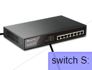

<h2 id="Router">
3.2 Routers
</h2>

### 3.2.1 Router Functionality

| Function | Description | Example |
|----------|-------------|---------|
| Path determination | Finds best route | OSPF, RIP, BGP |
| Packet forwarding | Moves packets between networks | IP routing |
| NAT | Translates private to public | Internet sharing |
| Firewall | Filters traffic | Access control lists |

### 3.2.2 Layer 3 Operation

| OSI Layer | Protocol | Device | Address |
|-----------|----------|--------|---------|
| Layer 3 (Network) | IP | Router | IP Address |
| Layer 2 (Data Link) | Ethernet | Switch | MAC Address |
| Layer 1 (Physical) | Electrical | Hub | N/A |

### 3.2.3 Interface Requirements Table

| Interface Property | Requirement | Reason |
|-------------------|-------------|--------|
| IP Address | Unique | No duplicates |
| Subnet Mask | Consistent per network | Same network devices |
| Network Range | Non-overlapping | Separate networks |

### 3.2.4 Non-overlapping Rule Examples

| Scenario | Interface A | Interface B | Valid? |
|----------|-------------|-------------|--------|
| Good | 192.168.1.0/24 | 192.168.2.0/24 | ✅ |
| Bad | 192.168.1.0/24 | 192.168.1.128/25 | ❌ |
| Good | 10.0.0.0/8 | 172.16.0.0/12 | ✅ |
| Bad | 172.16.0.0/16 | 172.16.1.0/24 | ❌ |

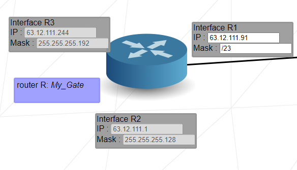

<h2 id="RoutingTable">
3.3 Routing Tables
</h2>

### 3.3.1 Routing Table Structure

| Field | Description | Format | Example |
|-------|-------------|--------|---------|
| Destination | Target network | IP/CIDR | 192.168.1.0/24 |
| Next Hop | Next router IP | IP Address | 10.0.0.1 |
| Interface | Outgoing interface | Name | eth0 |
| Metric | Distance/cost | Number | 1-255 |

### 3.3.2 Destination Field Examples

| Destination Type | Format | Meaning |
|------------------|--------|---------|
| Specific network | 192.168.1.0/24 | Route to this network |
| Specific host | 192.168.1.10/32 | Route to single host |
| Default | 0.0.0.0/0 | Catch-all route |
| Summary | 10.0.0.0/8 | Route to large block |

### 3.3.3 Next Hop Field Rules

| Scenario | Next Hop | Example |
|----------|----------|---------|
| Directly connected | None (interface only) | eth0 |
| One router away | Router IP | 192.168.1.1 |
| Multiple hops | Next router in path | 10.0.0.2 |

### 3.3.4 Default Route Scenarios

| Situation | Default Route | Why |
|-----------|--------------|-----|
| Internet access | 0.0.0.0/0 → ISP router | Send all unknown traffic |
| Stub network | 0.0.0.0/0 → upstream router | Only one way out |
| Core router | No default | Knows all routes |

### 3.3.5 Direct vs Remote Networks

| Network Type | Route Entry | Next Hop Needed |
|--------------|-------------|-----------------|
| Directly connected | 192.168.1.0/24 | No (interface only) |
| Remote network | 10.0.0.0/8 | Yes (router IP) |

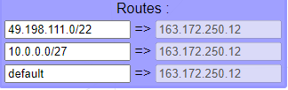

---

# SECTION 4: INTERNET CONNECTIVITY

<h2 id="InternetConnectivity">
4.1 ISP and Public IPs
</h2>

| Component | Function | Example |
|-----------|----------|---------|
| ISP | Provides Internet access | Comcast, AT&T, Verizon |
| Public IP | Globally routable address | 8.8.8.8 |
| Assignment | Static or Dynamic | DHCP or manual |

<h2 id="NAT">
4.2 NAT (Network Address Translation)
</h2>

| NAT Type | Description | Use Case |
|----------|-------------|----------|
| Static NAT | One-to-one mapping | Public server |
| Dynamic NAT | Pool of public IPs | Multiple users |
| PAT (NAPT) | Many-to-one with ports | Home router |

<h2 id="DHCP">
4.3 DHCP (Dynamic Host Configuration)
</h2>

| DHCP Process | Description | Direction |
|--------------|-------------|-----------|
| DISCOVER | Client broadcasts for server | Client → Server |
| OFFER | Server offers IP | Server → Client |
| REQUEST | Client accepts offer | Client → Server |
| ACK | Server confirms | Server → Client |

<h2 id="PublicPrivate">
4.4 Public vs Private IPs
</h2>

| Feature | Public IP | Private IP |
|---------|-----------|------------|
| Uniqueness | Globally unique | Locally unique |
| Routing | Internet routable | Not internet routable |
| Cost | Paid to ISP | Free |
| Assignment | By IANA/ISP | By local admin |
| Example | 8.8.8.8 | 192.168.1.1 |

---

# SECTION 5: LEVEL SOLUTIONS (Grouped by Concept)

## GROUP A: Basic Concepts

<details>
<summary><b>5.A.1 Level 1 - Direct Connections</b></summary>

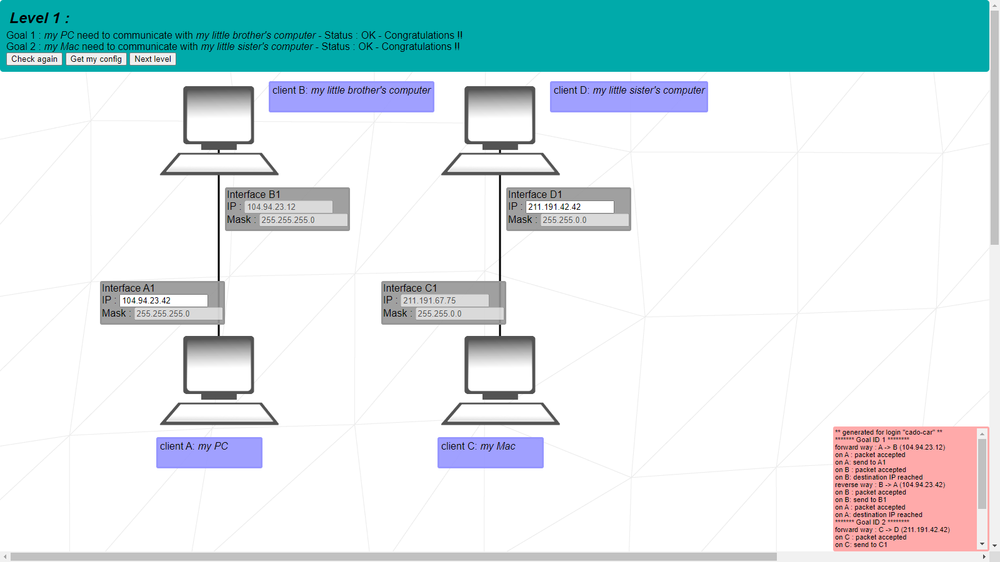

### Network Configuration Table

| Connection | Mask | Network | Usable Range |
|------------|------|---------|--------------|
| A ↔ B | /24 (255.255.255.0) | 104.94.23.0/24 | 104.94.23.1 - 104.94.23.254 |
| C ↔ D | /16 (255.255.0.0) | 211.191.0.0/16 | 211.191.0.1 - 211.191.255.254 |

### IP Assignment Options

| Device | Required | Options |
|--------|----------|---------|
| Client A | Must match B's network | 104.94.23.1 - 104.94.23.254 |
| Client B | Fixed (not shown) | 104.94.23.x |
| Client C | Fixed | 211.191.x.x |
| Client D | Must match C's network | 211.191.0.1 - 211.191.255.254 |

**Key Takeaway**: Devices must share the same network portion.
</details>

<details>
<summary><b>5.A.2 Level 2 - Subnet Boundaries</b></summary>

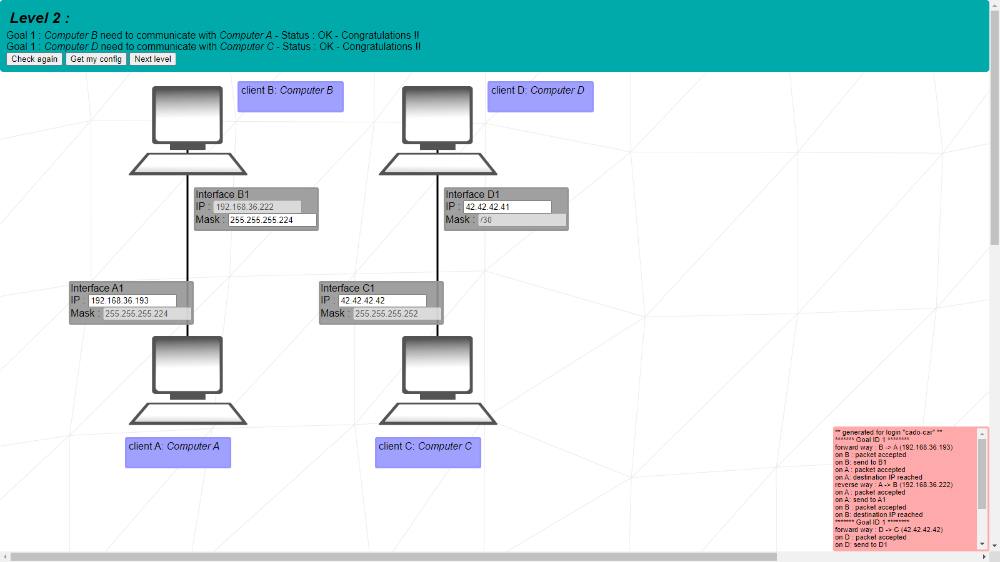

### Network 1 Analysis (/27)

| Parameter | Value |
|-----------|-------|
| Mask | 255.255.255.224 (/27) |
| Client B IP | 192.168.36.222 |
| Block Size | 32 addresses |
| Network Address | 192.168.36.192 |
| Broadcast | 192.168.36.223 |
| Usable Range | 192.168.36.193 - 192.168.36.222 |

### Network 2 Analysis (/30)

| Parameter | Value |
|-----------|-------|
| Mask | 255.255.255.252 (/30) |
| Block Size | 4 addresses |
| Usable IPs | 2 per subnet |
| Pattern | x.x.x.1 and x.x.x.2 |
| Reserved | x.x.x.0 (network), x.x.x.3 (broadcast) |

### /30 Subnet Examples

| Subnet | Network | Usable | Broadcast |
|--------|---------|--------|-----------|
| 1 | 192.168.1.0 | 192.168.1.1, 192.168.1.2 | 192.168.1.3 |
| 2 | 192.168.1.4 | 192.168.1.5, 192.168.1.6 | 192.168.1.7 |
| 3 | 192.168.1.8 | 192.168.1.9, 192.168.1.10 | 192.168.1.11 |

**Key Takeaway**: /30 networks are perfect for point-to-point links.
</details>

<details>
<summary><b>5.A.3 Level 3 - Switch Networks</b></summary>

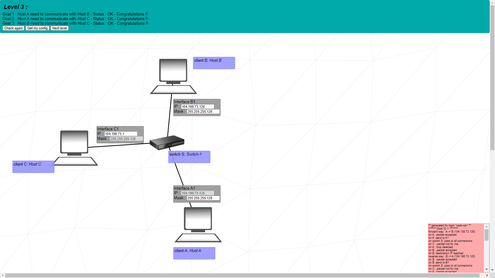

### Network Configuration

| Parameter | Value |
|-----------|-------|
| Mask | 255.255.255.128 (/25) |
| Client A IP | 104.198.73.125 |
| Block Size | 128 addresses |
| Network Address | 104.198.73.0 |
| Broadcast | 104.198.73.127 |
| Usable Range | 104.198.73.1 - 104.198.73.126 |

### Device Requirements

| Device | Mask | IP Range | Status |
|--------|------|----------|--------|
| Client A | /25 | 104.198.73.125 | Fixed |
| Client B | /25 | 104.198.73.x | Choose any usable |
| Client C | /25 | 104.198.73.x | Choose any usable |

**Key Takeaway**: All devices connected to a switch must be in the same subnet.
</details>

## GROUP B: Router Introduction

<details>
<summary><b>5.B.1 Level 4 - First Router</b></summary>

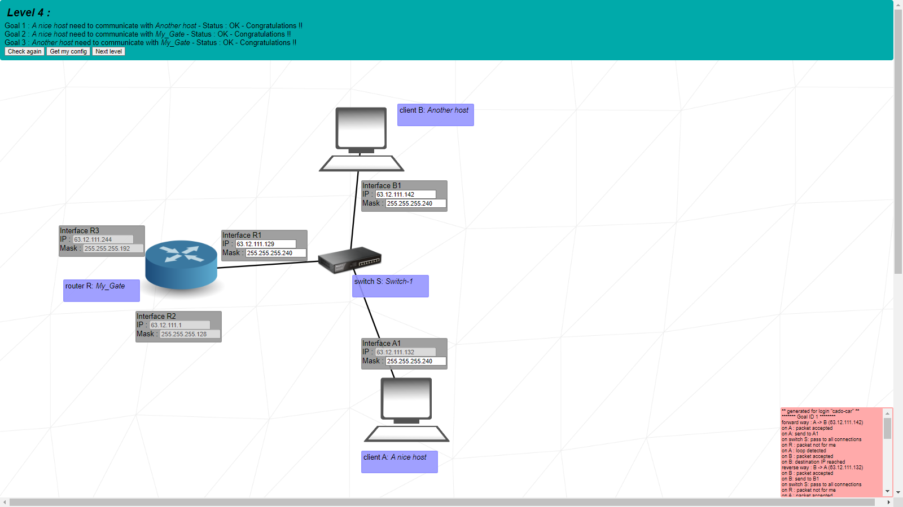

### Router R Existing Interfaces

| Interface | IP Range | Mask | Network |
|-----------|----------|------|---------|
| R2 | 63.12.111.0 - 63.12.111.127 | /25 | 63.12.111.0/25 |
| R3 | 63.12.111.192 - 63.12.111.255 | /26 | 63.12.111.192/26 |

### Gap Analysis

| Range | Start | End | Size |
|-------|-------|-----|------|
| R2 range | 63.12.111.0 | 63.12.111.127 | 128 |
| GAP | 63.12.111.128 | 63.12.111.191 | 64 |
| R3 range | 63.12.111.192 | 63.12.111.255 | 64 |

### Possible Mask Options for Client A (IP: 63.12.111.132)

| Mask | CIDR | Network | Broadcast | Overlap? |
|------|------|---------|-----------|----------|
| 255.255.255.128 | /25 | .128 | .255 | ❌ (overlaps R3) |
| 255.255.255.192 | /26 | .128 | .191 | ✅ (fits gap) |
| 255.255.255.224 | /27 | .128 | .159 | ✅ (fits gap) |
| 255.255.255.240 | /28 | .128 | .143 | ✅ (fits gap) |
| 255.255.255.248 | /29 | .128 | .135 | ✅ (fits gap) |

**Recommended**: /28 (255.255.255.240) for safety margin

**Key Takeaway**: Router interfaces must have non-overlapping IP ranges.
</details>

<details>
<summary><b>5.B.2 Level 5 - Routing Tables</b></summary>

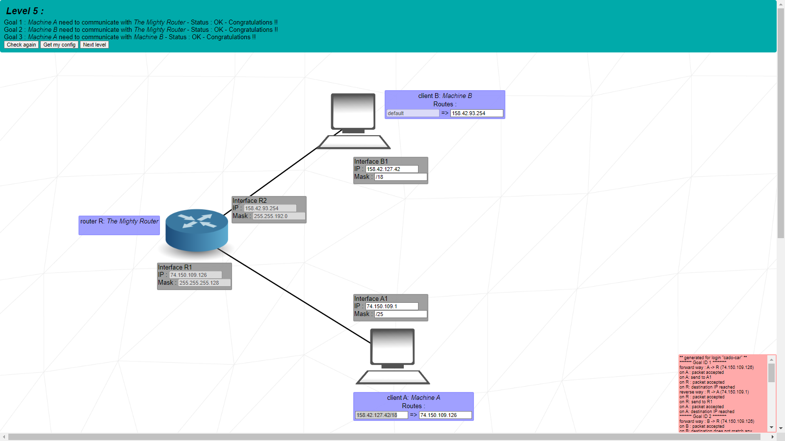

### Network 1 (Client A - R1)

| Parameter | Value |
|-----------|-------|
| Mask | 255.255.255.128 (/25) |
| Network | 74.150.109.0/25 |
| Range | 74.150.109.0 - 74.150.109.127 |
| Usable | 74.150.109.1 - 74.150.109.126 |

### Network 2 (Client B - R2)

| Parameter | Value |
|-----------|-------|
| Mask | 255.255.192.0 (/18) |
| Network | 158.42.64.0/18 |
| Range | 158.42.64.0 - 158.42.127.255 |
| Usable | 158.42.64.1 - 158.42.127.254 |

### Routing Tables

**Client A Routing Table Options**:

| Destination | Next Hop | Type |
|-------------|----------|------|
| 158.42.127.42/18 | [R1 IP] | Specific |
| 0.0.0.0/0 | [R1 IP] | Default |

**Client B Routing Table Options**:

| Destination | Next Hop | Type |
|-------------|----------|------|
| [Client A IP]/25 | [R2 IP] | Specific |
| 0.0.0.0/0 | [R2 IP] | Default |

**Key Takeaway**: Routing tables tell devices how to reach remote networks.
</details>

## GROUP C: Internet & Multiple Networks

<details>
<summary><b>5.C.1 Level 6 - Internet Connectivity</b></summary>

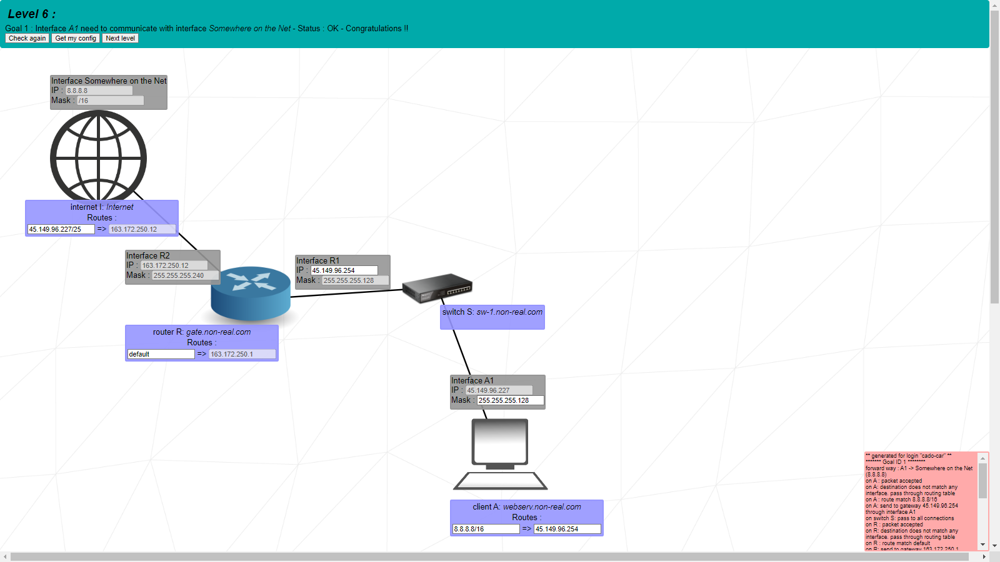

### Local Network Configuration

| Device | IP | Mask | Range |
|--------|----|------|-------|
| R1 | 45.149.96.254 | /25 | 45.149.96.128 - 45.149.96.255 |
| Client A | 45.149.96.227 | /25 | Within R1's network |

### Routing Tables

**Client A Routing Table**:
| Destination | Next Hop | Purpose |
|-------------|----------|---------|
| 8.8.8.8/16 | 45.149.96.254 | Specific Internet host |
| 0.0.0.0/0 | 45.149.96.254 | All Internet traffic |

**Internet I Routing Table**:
| Destination | Next Hop | Purpose |
|-------------|----------|---------|
| 45.149.96.227/25 | [R2 IP] | Return traffic to Client A |
| 0.0.0.0/0 | [R2 IP] | All other traffic |

**Router R Routing Table**:
| Destination | Next Hop | Purpose |
|-------------|----------|---------|
| 0.0.0.0/0 | [Internet I IP] | Send all unknown traffic to Internet |

**Key Takeaway**: The Internet is just another network with its own routing table.
</details>

<details>
<summary><b>5.C.2 Level 7 - Multiple Routers</b></summary>

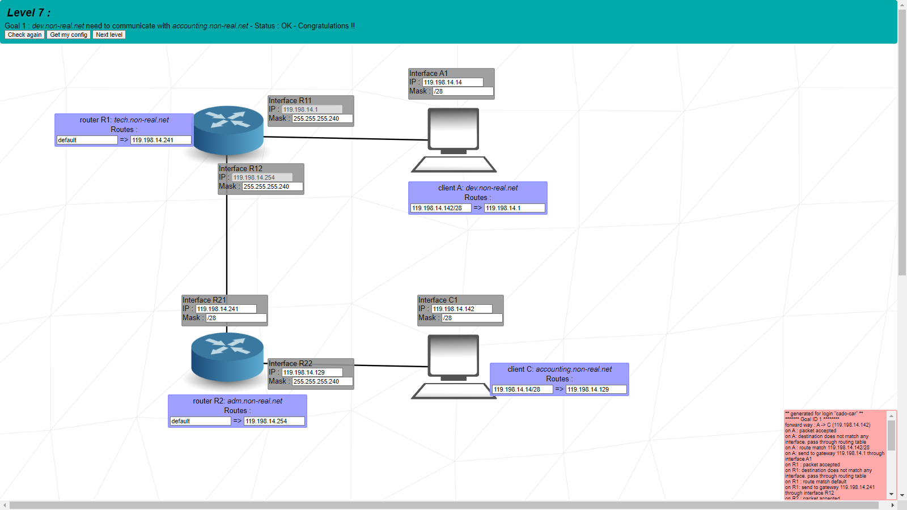

### Network Segmentation Table

| Network | Devices | Range Choice | Network Address | Broadcast |
|---------|---------|--------------|-----------------|-----------|
| Net 1 | A1, R11 | 119.198.14.0/28 | 119.198.14.0 | 119.198.14.15 |
| Net 2 | R12, R21 | 119.198.14.240/28 | 119.198.14.240 | 119.198.14.255 |
| Net 3 | R22, C1 | 119.198.14.128/28 | 119.198.14.128 | 119.198.14.143 |

### IP Assignment Table

| Network | Available Range | Fixed IPs | Choose From |
|---------|-----------------|-----------|-------------|
| Net 1 | .1 - .14 | R11: .1 | A1: .2 - .14 |
| Net 2 | .241 - .254 | R12: .254 | R21: .241 - .253 |
| Net 3 | .129 - .142 | None | R22: any, C1: any (different) |

### Routing Tables

**Client A Routing Table**:
| Destination | Next Hop |
|-------------|----------|
| [Client C IP]/28 | 119.198.14.254 (R12) |

**Client C Routing Table**:
| Destination | Next Hop |
|-------------|----------|
| [Client A IP]/28 | [R22 IP] |

**Router R1 Routing Table**:
| Destination | Next Hop |
|-------------|----------|
| [Network 3]/28 | [R21 IP] |

**Router R2 Routing Table**:
| Destination | Next Hop |
|-------------|----------|
| [Network 1]/28 | 119.198.14.254 (R12) |

**Key Takeaway**: Each router needs routes to networks not directly connected.
</details>

<details>
<summary><b>5.C.3 Level 8 - Internet with Multiple Hosts</b></summary>

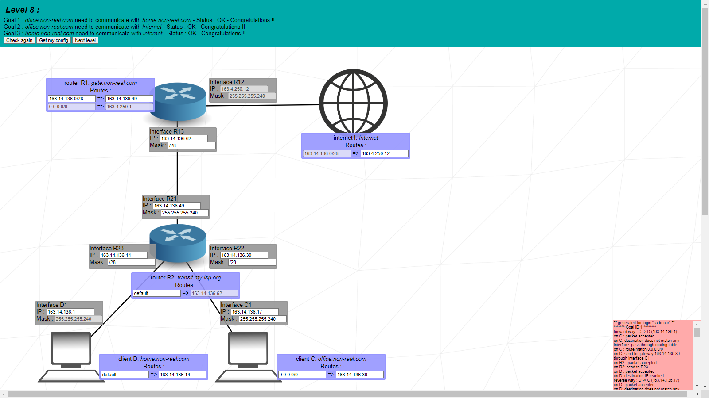

### Internet Constraint

| Parameter | Value |
|-----------|-------|
| Internet Route | 163.14.136.0/26 |
| Total Range | 163.14.136.0 - 163.14.136.63 |
| Networks Required | 3 |

### Subnet Division (/28)

| Subnet | Range | Network | Broadcast | Use |
|--------|-------|---------|-----------|-----|
| 1 | .0 - .15 | 163.14.136.0 | 163.14.136.15 | Network 2 |
| 2 | .16 - .31 | 163.14.136.16 | 163.14.136.31 | Network 1 |
| 3 | .32 - .47 | 163.14.136.32 | 163.14.136.47 | Spare |
| 4 | .48 - .63 | 163.14.136.48 | 163.14.136.63 | Network 3 |

### Detailed Network Allocation

**Network 1 (C1-R22)**:
| Field | Value |
|-------|-------|
| Range | 163.14.136.16 - 163.14.136.31 |
| Usable | 163.14.136.17 - 163.14.136.30 |
| Mask | /28 (255.255.255.240) |

**Network 2 (D1-R23)**:
| Field | Value |
|-------|-------|
| Range | 163.14.136.0 - 163.14.136.15 |
| Usable | 163.14.136.1 - 163.14.136.14 |
| Mask | /28 (255.255.255.240) |

**Network 3 (R21-R13)**:
| Field | Value |
|-------|-------|
| Range | 163.14.136.48 - 163.14.136.63 |
| Usable | 163.14.136.49 - 163.14.136.62 |
| Mask | /28 (255.255.255.240) |
| R13 must be | 163.14.136.62 (next hop in Internet) |

**Key Takeaway**: All networks must be within the Internet's known range.
</details>

## GROUP D: Complex Scenarios

<details>
<summary><b>5.D.1 Level 9 - Complex Multi-Network</b></summary>

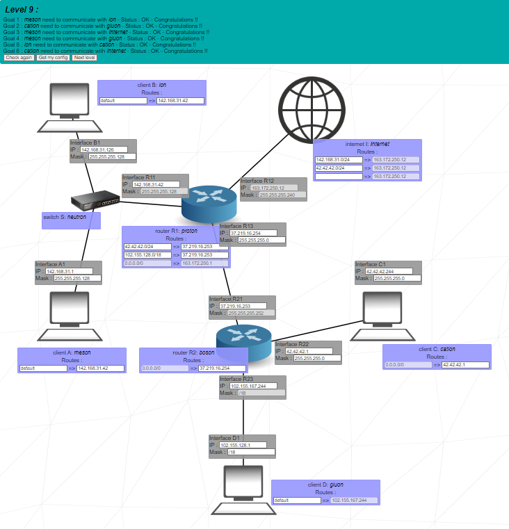

### Network Specifications Table

| Network | Devices | Mask | Network Range | Usable Range |
|---------|---------|------|---------------|--------------|
| Net 1 | A1, B1, R11 | /25 | 142.168.31.0 - 142.168.31.127 | .1 - .126 |
| Net 2 | C1, R22 | /24 | 42.42.42.0 - 42.42.42.255 | .1 - .254 |
| Net 3 | D1, R23 | /18 | 102.155.128.0 - 102.155.191.255 | .128.1 - .191.254 |
| Net 4 | R13, R21 | /30 | 37.219.16.252 - 37.219.16.255 | .253 - .254 |

### Critical Constraints

| Constraint | Value | Notes |
|------------|-------|-------|
| R23 IP | 102.155.167.244 | Must be in Net 3 |
| D1 Next Hop | [R23 IP] | From routing table |
| Internet needs | Routes to "meson" and "cation" | Both hosts |

### IP Assignment Suggestions

**Network 1** (142.168.31.0/25):
- R11: 142.168.31.1
- A1: 142.168.31.2
- B1: 142.168.31.3

**Network 2** (42.42.42.0/24):
- R22: 42.42.42.1
- C1: 42.42.42.2

**Network 3** (102.155.128.0/18):
- R23: 102.155.167.244 (fixed)
- D1: 102.155.167.245

**Network 4** (37.219.16.252/30):
- R13: 37.219.16.253
- R21: 37.219.16.254

### Internet Routing Table

| Destination | Next Hop |
|-------------|----------|
| 142.168.31.0/25 | [R1 Internet interface] |
| 102.155.128.0/18 | [R1 Internet interface] |

**Key Takeaway**: Internet can have multiple routes pointing to the same next hop.
</details>

<details>
<summary><b>5.D.2 Level 10 - Final Challenge</b></summary>

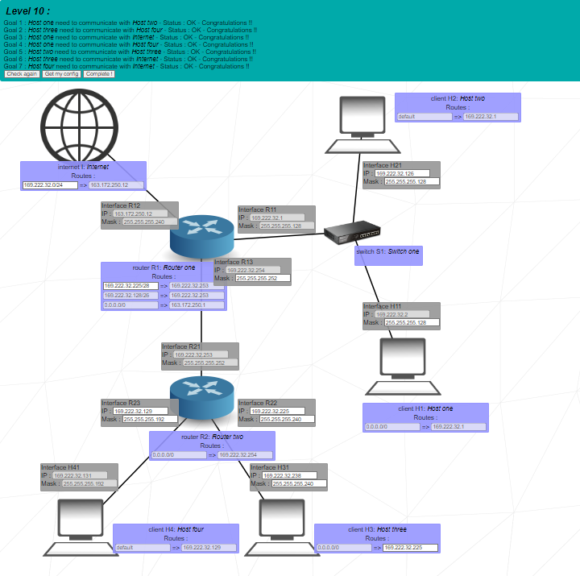

### Master Constraint

| Parameter | Value |
|-----------|-------|
| Internet Route | 169.222.32.0/24 |
| Total Range | 169.222.32.0 - 169.222.32.255 |
| Networks Required | 4 |

### Network Allocation Table

| Network | Devices | Mask | Range | Usable |
|---------|---------|------|-------|--------|
| Net 1 | H11, H21, R11 | /25 | .0 - .127 | .1 - .126 |
| Net 2 | H31, R22 | /28 | .224 - .239 | .225 - .238 |
| Net 3 | H41, R23 | /26 | .128 - .191 | .129 - .190 |
| Net 4 | R21, R13 | /30 | .252 - .255 | .253 - .254 |

### Detailed Subnet Breakdown

**Network 1 (/25)**:
```
Range:     169.222.32.0 - 169.222.32.127
Network:   169.222.32.0
Broadcast: 169.222.32.127
Usable:    169.222.32.1 - 169.222.32.126
Devices:   3 (H11, H21, R11)
```

**Network 2 (/28)**:
```
Range:     169.222.32.224 - 169.222.32.239
Network:   169.222.32.224
Broadcast: 169.222.32.239
Usable:    169.222.32.225 - 169.222.32.238
Devices:   2 (H31, R22)
```

**Network 3 (/26)**:
```
Range:     169.222.32.128 - 169.222.32.191
Network:   169.222.32.128
Broadcast: 169.222.32.191
Usable:    169.222.32.129 - 169.222.32.190
Devices:   2 (H41, R23)
```

**Network 4 (/30)**:
```
Range:     169.222.32.252 - 169.222.32.255
Network:   169.222.32.252
Broadcast: 169.222.32.255
Usable:    169.222.32.253 - 169.222.32.254
Devices:   2 (R21, R13)
```

### IP Assignment Example

| Device | IP Address | Network |
|--------|------------|---------|
| R11 | 169.222.32.1 | Net 1 |
| H11 | 169.222.32.2 | Net 1 |
| H21 | 169.222.32.3 | Net 1 |
| R22 | 169.222.32.225 | Net 2 |
| H31 | 169.222.32.226 | Net 2 |
| R23 | 169.222.32.129 | Net 3 |
| H41 | 169.222.32.130 | Net 3 |
| R13 | 169.222.32.253 | Net 4 |
| R21 | 169.222.32.254 | Net 4 |

**Key Takeaway**: Careful subnet planning is essential when working within a limited address space.
</details>

---

# SECTION 6: LEARNING TOOLS

<h2 id="QuickReference">
6.1 Quick Reference Charts
</h2>

### 6.1.1 Common Pitfalls Table

| Problem | Symptoms | Solution |
|---------|----------|----------|
| Overlapping router interfaces | Some networks unreachable | Check all interface ranges |
| Using reserved addresses | Device can't communicate | Avoid network/broadcast addresses |
| Mismatched subnet masks | Devices in same LAN can't talk | All devices in same LAN need same mask |
| Missing return route | One-way communication | Ensure bidirectional routing |
| Wrong next hop | Packets don't arrive | Next hop must be in same network |
| Duplicate IPs | Address conflict error | Assign unique IPs |
| Wrong default gateway | Can't reach Internet | Default gateway must be in local subnet |
| Private IP on Internet | Packets dropped | Use NAT for Internet access |

### 6.1.2 Verification Checklist

- [ ] All devices in same LAN have identical subnet masks
- [ ] No duplicate IP addresses anywhere
- [ ] Router interfaces have non-overlapping ranges
- [ ] Network addresses not assigned to devices
- [ ] Broadcast addresses not assigned to devices
- [ ] Routing tables have return paths for all destinations
- [ ] Next hop addresses are reachable (in same network)
- [ ] Private IPs used only where appropriate
- [ ] Default routes configured where needed
- [ ] All required networks have routes
- [ ] Bidirectional communication tested

<h2 id="PracticeExercises">
6.2 Practice Exercises
</h2>

### 6.2.1 Subnet Calculation Practice

**Exercise 1**: Given IP 192.168.1.45/27
- Find network address: _____
- Find broadcast address: _____
- Find usable range: _____
- How many hosts? _____

**Exercise 2**: You need a network with 50 hosts
- What's the smallest CIDR? _____
- What subnet mask? _____
- How many total IPs? _____
- How many wasted? _____

**Exercise 3**: Divide 10.0.0.0/24 into 4 equal subnets
- Subnet 1: _____
- Subnet 2: _____
- Subnet 3: _____
- Subnet 4: _____

### 6.2.2 Routing Table Exercises

**Exercise 1**: Router has interfaces:
- eth0: 192.168.1.1/24
- eth1: 10.0.0.1/24
- Need to reach 172.16.0.0/16 via 10.0.0.2
Write routing table entry: _____

**Exercise 2**: Which next hop is valid?
- Destination: 192.168.2.0/24
- Next hop options: 192.168.1.1, 8.8.8.8, 10.0.0.1
- Router's LAN: 192.168.1.0/24
Valid next hop: _____

### 6.2.3 Network Design Problems

**Problem 1**: Design a network for:
- 3 departments (60, 30, 20 hosts)
- Use 192.168.1.0/24
- Show subnet divisions

**Problem 2**: Connect two remote offices:
- Office A: 192.168.1.0/24
- Office B: 192.168.2.0/24
- Need router with 2 interfaces
- Show IP assignments

---

# APPENDIX: Quick Reference Cards

## A.1 Subnet Mask Quick Card

| Need This Many Hosts | Use This CIDR | Subnet Mask |
|---------------------|---------------|-------------|
| 2 | /30 | 255.255.255.252 |
| 6 | /29 | 255.255.255.248 |
| 14 | /28 | 255.255.255.240 |
| 30 | /27 | 255.255.255.224 |
| 62 | /26 | 255.255.255.192 |
| 126 | /25 | 255.255.255.128 |
| 254 | /24 | 255.255.255.0 |

## A.2 Binary to Decimal Quick Card

| Binary | Decimal |
|--------|---------|
| 10000000 | 128 |
| 11000000 | 192 |
| 11100000 | 224 |
| 11110000 | 240 |
| 11111000 | 248 |
| 11111100 | 252 |
| 11111110 | 254 |
| 11111111 | 255 |

## A.3 Common Network Addresses

| Purpose | Address |
|---------|---------|
| Google DNS | 8.8.8.8 |
| Cloudflare DNS | 1.1.1.1 |
| Localhost | 127.0.0.1 |
| Default Route | 0.0.0.0/0 |
| Broadcast (local) | 255.255.255.255 |
```
